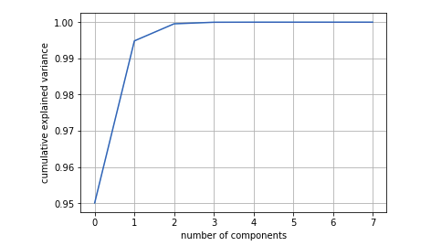

## Importance of Feature Selection and Feature Learning

Investing the time upfront on feature selection or feature extraction is critical. Recently, I was analyzing the california housing dataset and I was pleasantly surprised that a single feature, extracted using Principal Component Analysis could explain as much as 99.5 percent of the variance.
<figure >
  
</figure> 
I used the Isolation forests to identify the outliers in the data. I then mapped plotted the outliers on a plot using the first two principal components. It appears that the second principal component captures the outliers in the data.
<figure >
  
</figure> 

