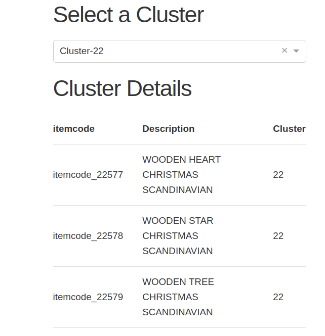
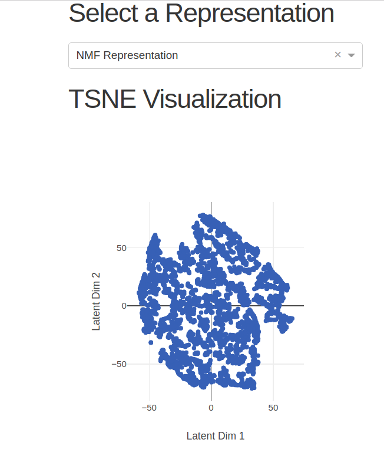
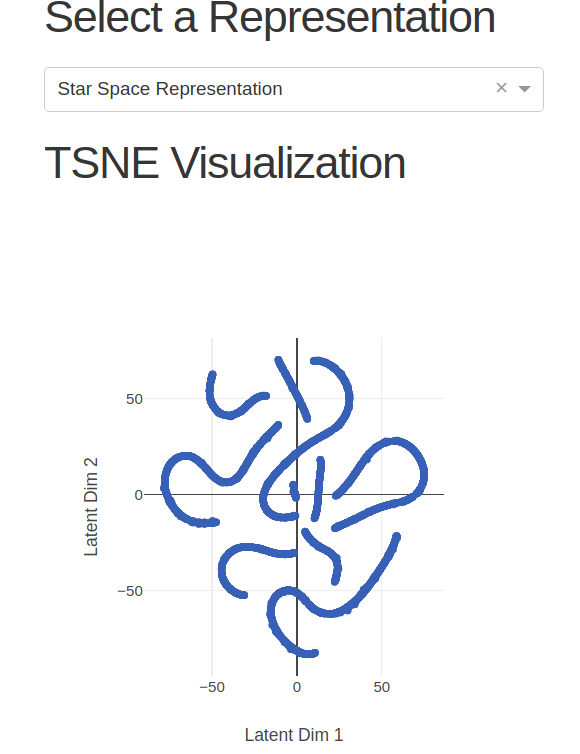

## Analysis of Retail Data Using Starspace Embeddings

The <a href = "https://github.com/facebookresearch/StarSpace"> starspace library</a> from Facebook seemed like a promising idea to learn embeddings for categorical attributes. Curious to try this out, I used the <a href = "https://archive.ics.uci.edu/ml/datasets/online+retail"> retail dataset</a> from the UCI repository. I used the  "Page space/user embeddings" model to learn the embeddings for the items in this dataset. I used a user representation where each user was represented by the average of the items associated with him/her (as indicated in the documentation). This representation does not account for the quantity of each item purchased and the value of the item. To account for these, I added attributes that capture the number of items purchased by the user and the amount spent at the store to the user. I then clustered the item representations and the user representations. I used hdbscan for clustering. The results were interesting. An example of a cluster is shown below. As is evident, the items in this cluster are very similar. The other clusters too seemed similar. So perhaps this is a promising approach.
<figure >
  
</figure> 
A typical approach to these problems is to capture the user by a long vector. This vector has entries corresponding to the users affinity for a particular item. This is a sparse vector. Non-negative factorization can be used to factorize this representation into user and item latent factors. I used sklearn implementation to do this. I then clustered the latent user representations. I wanted to compare the user clustering I obtained with this approach with the user clustering obtained using the starspace representation. The visualizations of the starspace representation and the non-negative matrix factorization representations are shown below. As is evident, the representations are quite different. I used the <a href="https://plot.ly/products/dash/">dash</a> library to generate dashboard visualizations.
<figure >
  
</figure> 

<figure >
  
</figure> 

