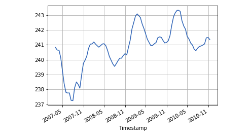
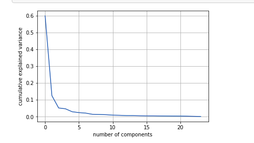
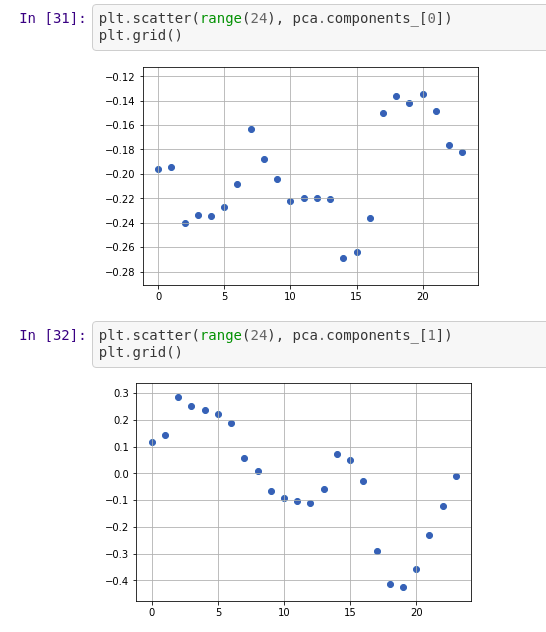

I wanted to try to use PCA to extract the independent components of variation in large time series data. To this end, I used the household power consumption dataset that provides voltage measurements at one minute intervals over a four year period. This data is dirty. It has missing data for 82 days in this period. So conventional auto-regressive models cannot be applied directly to the entire dataset. However, that is material for another day. A plot of the rolling mean of the voltage values using a 15 day (bi-monthly) window is shown below. Clearly, seaosonal patterns are evident.
<figure >
  
</figure> 
To analyze independent patterns of variation over this four year period. I aggregated data at hourly intervals. A day is represented by a 24 hour vector. Each component of this vector represents the hourly mean voltage for that period. A sample of the dataset is shown below:

<figure >
  
</figure> 

In about 5 principal components we can explain the mean hourly variations of voltage in this dataset

<figure >
  
</figure>

The first two principal components are shown below. These two components represent major variations in hourly mean voltage over this period.

<figure >
  
</figure>