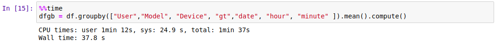
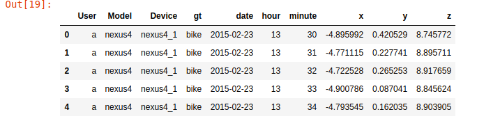

I found the <a href="https://dask.org/">Dask</a> package very useful for the analysis of big datasets. Usually when dealing with massive datasets that I have to explore and analyze, the tools I use are either Spark or Hive. I like Spark, especially after the dataframe abstraction was introduced. For those who repeatedly use SQL or pandas for data analysis, this hit the sweet spot. Using familiar semantics to work with data helps a lot in getting acclimatized to a new tool. Then I ran into dask. While pyspark was nice, this seemed even better to me. I tried using Dask to analyze the <a href = "https://archive.ics.uci.edu/ml/datasets/Heterogeneity+Activity+Recognition">Activity Recognition dataset </a> with Dask and found the going pretty smooth. This dataset is massive. It has sensor data from phones and smart watches. An important activity with this dataset is to identify the users activity given sensor and device information. I used the accelerometer data that is part of this dataset. This has well over 13 million rows in raw form. 

It turns out that the accelerometers in these phones generate a lot of samples every second (over a hundred samples a second is not uncommon). Predicting the user's activity based on samples received over the past minute seems like a question of interest. A minute seemed a like a reasonable period of time to observe and collect data. Conventional approaches to working with recoginition of activity create a long feature vecture of values that represent sequential values of acceleration collected over a period of time with overlapping windows (see <a href="https://www.kaggle.com/uciml/human-activity-recognition-with-smartphones/home">this</a>, for example). However, the purpose of this exercise is to illustrate the ease with which a relatively large dataset can be analyzed using Dask on a laptop. Furthermore, this analysis also provides insights that are useful from an exploratory perspective. The raw accelerometer data has over 13 million records. Dask was able to compute a group by is less than 2 minutes. Impressive!
 

<figure >
  
</figure> 

This group by aggregates user activity by the minute and computes the acceleration components. We can generate a dataset where each record represents the avg acceleration for an observed minute of activity. So a learning task that is relevant is:
<blockquote>
Given average accelerations observed over a one minute interval, can we predict the user's activity?
</blockquote>

Here is a sample of the summarized dataset. By generating this summary, we have reduced the 13 million records to about 2600 records for the learning task. As with the house hold power dataset example, the dataset that you use for learning that is generated from the massive raw dataset is not necessarily big.
<figure >
  
</figure> 

Using a simple decision tree classifier or a random forest classifier we can predict the user's activity to an accuracy of about 83 %. This classifier is based on a pretty simple data representation. We just use the mean accelerations for the one minute window. Further feature engineering, like considering the previous minute's accelerations may help. I will probably explore this some time. Also related learning tasks could be sequential. For example, we may be interested in predicting the activity for the next minute, given labeled data up to this instant. We could consider deep learning models like RNN or LSTM for this purpose. However, having a tool like Dask to work with relatively large datasets on a laptop is really nice. Thanks <a href="https://matthewrocklin.com/"> Matthew Rocklin!</a>.
The code for this post is available <a href=""> here </a>.

